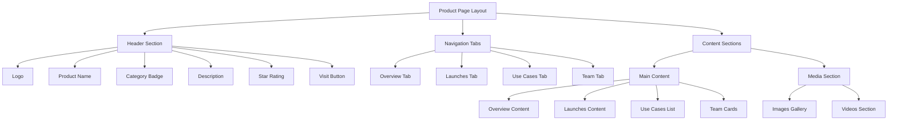

```mermaid
graph TD
    A[Product Page Layout] --> B[Header Section]
    A --> C[Navigation Tabs]
    A --> D[Content Sections]
    
    B --> B1[Logo]
    B --> B2[Product Name]
    B --> B3[Category Badge]
    B --> B4[Description]
    B --> B5[Star Rating]
    B --> B6[Visit Button]
    
    C --> C1[Overview Tab]
    C --> C2[Launches Tab]
    C --> C3[Use Cases Tab]
    C --> C4[Team Tab]
    
    D --> E[Main Content]
    D --> F[Media Section]
    
    E --> E1[Overview Content]
    E --> E2[Launches Content]
    E --> E3[Use Cases List]
    E --> E4[Team Cards]
    
    F --> F1[Images Gallery]
    F --> F2[Videos Section]
```